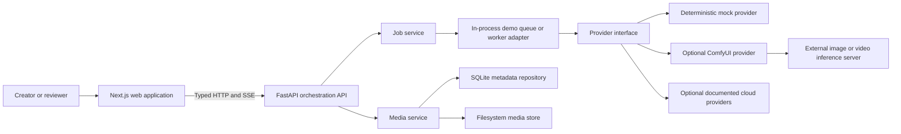
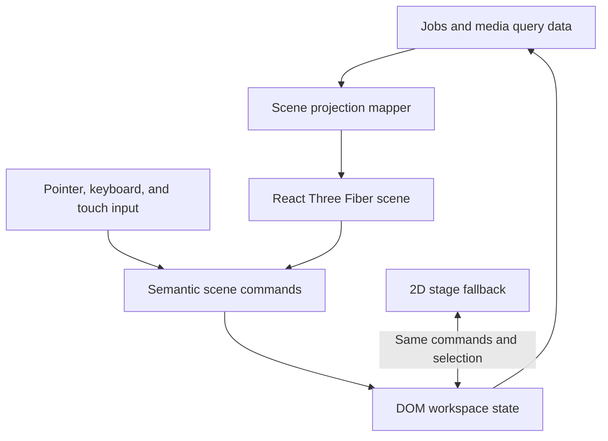
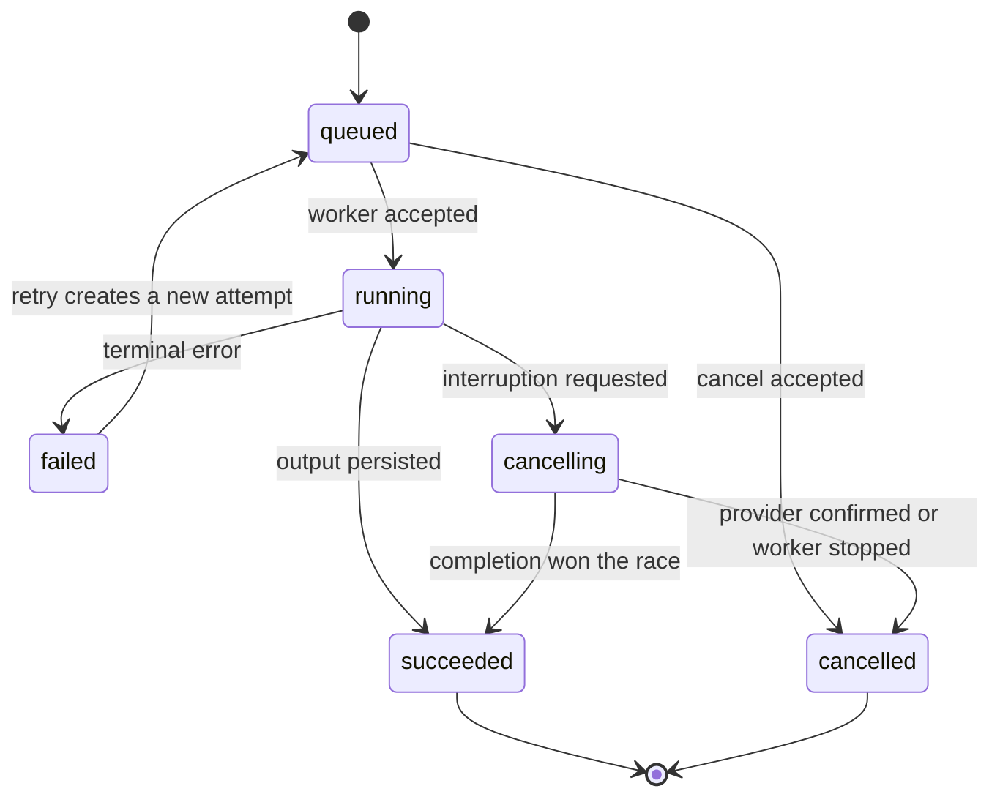

# CanvasRelay Architecture

**English** | [한국어](ko/architecture.md)

| Field | Value |
| --- | --- |
| Status | Draft |
| Last updated | 2026-07-31 |
| Related decision | [ADR 0001](adr/0001-nextjs-fastapi-monorepo.md) |

## 1. Architectural Goals

- Present one stable product model over heterogeneous generation providers.
- Keep provider credentials and local filesystem details outside the browser.
- Represent long-running work with explicit, testable state transitions.
- Keep media provenance intact from request through reuse.
- Load the immersive 3D experience without blocking the operational UI.
- Run a complete deterministic demo without paid services, model files, or GPU.
- Allow vertical migration from the private legacy application.

## 2. Non-Goals

- Replacing ComfyUI as a workflow graph editor.
- Executing model inference inside Next.js.
- Sharing one giant schema containing every provider-specific parameter.
- Requiring server rendering for interactive studio workspaces.
- Treating WebGL objects as the source of truth for domain state.

## 3. System Context



The browser communicates only with FastAPI. Provider tokens, ComfyUI addresses,
and storage paths remain server configuration.

## 4. Repository Shape

```text
canvasrelay/
|-- apps/
|   |-- web/
|   |   |-- src/app/
|   |   |-- src/features/
|   |   |-- src/components/
|   |   |-- src/lib/api/
|   |   `-- src/styles/
|   `-- api/
|       |-- app/api/
|       |-- app/domain/
|       |-- app/providers/
|       |-- app/repositories/
|       |-- app/services/
|       `-- tests/
|-- packages/
|   `-- contracts/
|-- docs/
|   `-- adr/
|-- examples/
|-- docker-compose.yml
|-- pnpm-workspace.yaml
`-- README.md
```

`packages/contracts` contains generated TypeScript API types and generation
scripts. Python domain models remain authoritative for wire schemas.

## 5. Web Application

### 5.1 Route Map

```text
app/
|-- (studio)/
|   |-- layout.tsx
|   |-- image/page.tsx
|   |-- video/page.tsx
|   |-- jobs/page.tsx
|   |-- library/page.tsx
|   `-- settings/page.tsx
|-- about/page.tsx
|-- error.tsx
`-- not-found.tsx
```

The default route redirects to the image workspace. `about` documents the
project and architecture but does not replace the usable first screen.

### 5.2 Frontend Boundaries

- **App Router layouts:** navigation shell, route loading, and error boundaries.
- **Feature modules:** image, video, jobs, library, settings, and prompt copilot.
- **TanStack Query:** remote jobs, media, providers, and invalidation.
- **React Hook Form and Zod:** request editing and client-side validation.
- **Zustand:** ephemeral spatial selection, camera, panel, and comparison state.
- **Generated API client:** the only path for browser-to-API domain requests.

Remote server state must not be copied into a global client store. The 3D scene
receives a projection of query data and emits semantic selection commands.

### 5.3 Immersive Scene Architecture



Rules for the scene:

- Use one `<Canvas>` for the active immersive workspace.
- Load it through a client-only dynamic boundary; the application shell renders
  independently.
- Use media planes, pipeline links, and state transitions with product meaning.
- Keep forms, text, metadata, menus, dialogs, and destructive actions in DOM.
- Default to `frameloop="demand"` outside active transitions.
- Cap device pixel ratio and reduce effects at constrained breakpoints.
- Pause when the document is hidden and dispose textures when assets leave view.
- Respect `prefers-reduced-motion` and expose a persistent 2D mode.
- Never make orbit or drag controls capture page scroll until the stage is
  explicitly focused.

### 5.4 3D Quality Verification

- Playwright screenshots at desktop, tablet, and mobile viewports.
- Canvas pixel checks to detect blank WebGL output.
- Interaction tests for focus, selection, reset, and 2D fallback.
- Renderer diagnostics collected in development for draw calls, textures, and
  geometries.
- Visual assets are tested for correct framing and must not cover controls.

## 6. API Application

### 6.1 Layer Responsibilities

| Layer | Responsibility |
| --- | --- |
| `api` | HTTP parsing, auth boundary, response status, dependency injection |
| `domain` | Job states, request schemas, asset provenance, errors |
| `services` | Use cases and transaction boundaries |
| `providers` | Translation to and from external generation engines |
| `repositories` | Metadata and binary storage interfaces |

Provider clients never return raw third-party payloads above the adapter layer.
They return normalized domain results or typed provider errors.

### 6.2 Initial HTTP Contract

```text
GET    /api/v1/health
GET    /api/v1/providers
POST   /api/v1/jobs
GET    /api/v1/jobs
GET    /api/v1/jobs/{job_id}
POST   /api/v1/jobs/{job_id}/cancel
POST   /api/v1/jobs/{job_id}/retry
GET    /api/v1/events
GET    /api/v1/media
GET    /api/v1/media/{asset_id}
DELETE /api/v1/media/{asset_id}
POST   /api/v1/prompts/suggest
```

`/api/v1/events` uses Server-Sent Events for one-way job updates. Clients fall
back to bounded polling when SSE is unavailable or disconnected.

### 6.3 Error Envelope

```json
{
  "error": {
    "code": "provider_unavailable",
    "message": "The selected provider is not available.",
    "action": "Check provider status or choose demo mode.",
    "requestId": "req_01...",
    "retryable": true
  }
}
```

Tracebacks, tokens, raw provider credentials, and personal paths never appear in
the public response envelope.

## 7. Job Domain

### 7.1 State Machine



The original job is immutable after terminal completion. Retry creates a new
attempt linked to the source job, preserving auditability.

### 7.2 Progress

Progress has a source and confidence, not only a percentage:

```text
phase: queued | loading | sampling | encoding | persisting | completed
current: optional integer
total: optional integer
percent: optional number
source: provider | inferred | unknown
```

If a provider has not begun execution, the UI says `Queued`; it does not display
an invented percentage.

### 7.3 Core Entities

- `GenerationRequest`: operation, provider, prompts, references, preset, params.
- `Job`: lifecycle, attempts, timestamps, progress, normalized error.
- `MediaAsset`: kind, location, dimensions, duration, checksum, provenance.
- `ProviderDescriptor`: capability flags, readiness, model options.
- `Preset`: versioned user-facing defaults separate from provider transport.

## 8. Provider Contract

Each adapter implements capability discovery, validation, submission, status,
cancellation where possible, and normalized result extraction.

```python
class GenerationProvider(Protocol):
    async def describe(self) -> ProviderDescriptor: ...
    async def validate(self, request: GenerationRequest) -> None: ...
    async def submit(self, request: GenerationRequest) -> ProviderJob: ...
    async def poll(self, job: ProviderJob) -> ProviderProgress: ...
    async def cancel(self, job: ProviderJob) -> CancelResult: ...
    async def collect(self, job: ProviderJob) -> list[ProviderOutput]: ...
```

The mock provider implements the same contract and is included in all automated
end-to-end tests.

## 9. Persistence

- SQLite stores jobs, attempts, media metadata, presets, and provenance.
- Binary image and video files use a `MediaStore` interface backed by the local
  filesystem in the first release.
- Filenames use generated IDs; user filenames are metadata only.
- Writes use temporary files and atomic rename where supported.
- The legacy JSON metadata importer is a migration utility, not a runtime
  dependency.
- Object storage can be added later without changing the media domain.

## 10. Security And Privacy

- Secrets are read by FastAPI from environment variables or a local ignored
  configuration file.
- The web bundle receives capability and redacted readiness data only.
- Uploads are restricted by declared media type, decoded content, and size.
- Storage paths are resolved against an owned root to prevent traversal.
- Logs use request IDs and structured redaction.
- CORS defaults to the documented local web origin.
- Generated samples included in the public repository are curated and safe.
- Public code uses documented provider APIs and does not include auth bypasses.

## 11. Observability

- Structured logs include `request_id`, `job_id`, `provider`, `phase`, and
  elapsed time.
- A health response distinguishes API, database, media store, and providers.
- Job events are persisted before being published to clients.
- Provider response summaries are debug-only and redacted.
- The UI can show recent normalized failures without exposing internal stacks.

## 12. Testing Strategy

| Scope | Tooling | Required coverage |
| --- | --- | --- |
| Web units | Vitest, Testing Library | forms, reducers, mapping, error UI |
| API units | Pytest | state transitions, adapters, repositories |
| Contract | OpenAPI generation check | schema drift and error envelope |
| Integration | Pytest with temporary SQLite/media root | jobs and persistence |
| End-to-end | Playwright with demo provider | create, cancel, retry, reuse |
| Visual | Playwright screenshots and canvas checks | responsive 2D and 3D views |

## 13. Runtime Profiles

### Demo

- Next.js, FastAPI, SQLite, filesystem media, deterministic mock provider.
- Starts without GPU, credentials, or model files.

### Local Inference

- Demo profile plus one or more external ComfyUI instances.
- Provider URLs and capabilities are configured server-side.

### Hosted Portfolio

- Demo provider enabled.
- Optional documented cloud adapters enabled only when deployment secrets exist.
- Local filesystem paths and private workflows are never assumed.

## 14. Architectural Fitness Checks

The architecture is considered healthy while these statements remain true:

- A provider can be added without changing workspace components.
- A 3D scene can be disabled without losing a required workflow action.
- A schema change fails CI until the generated TypeScript contract is updated.
- A mock end-to-end run is deterministic.
- A provider failure cannot corrupt existing media metadata.
- A private workflow can remain private while its generic provider contract is
  represented publicly.
