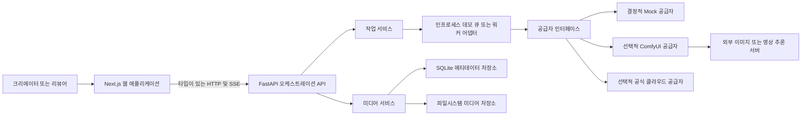
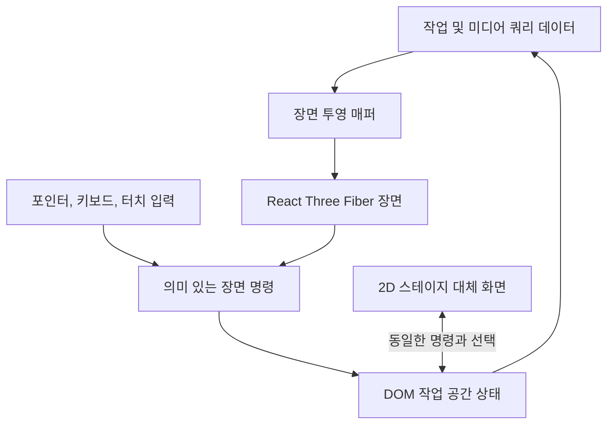
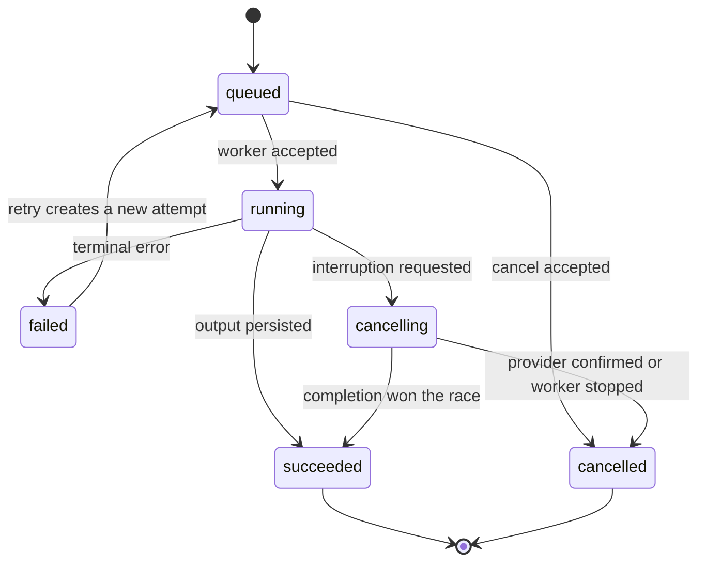

# CanvasRelay 아키텍처

[English](../architecture.md) | **한국어**

| 항목 | 값 |
| --- | --- |
| 상태 | 초안 |
| 최종 수정 | 2026-07-31 |
| 관련 결정 | [ADR 0001](adr/0001-nextjs-fastapi-monorepo.md) |

## 1. 아키텍처 목표

- 서로 다른 생성 공급자 위에 하나의 안정적인 제품 모델을 제공한다.
- 공급자 인증정보와 로컬 파일시스템 세부사항을 브라우저 밖에 둔다.
- 오래 걸리는 작업을 명시적이고 테스트 가능한 상태 전환으로 표현한다.
- 요청부터 재사용까지 미디어 생성 이력을 보존한다.
- 운영 UI를 막지 않으면서 이머시브 3D 경험을 로드한다.
- 유료 서비스, 모델 파일, GPU 없이 완전한 결정적 데모를 실행한다.
- 비공개 기존 애플리케이션에서 기능 단위로 이전할 수 있게 한다.

## 2. 비목표

- ComfyUI를 워크플로 그래프 편집기로서 대체하지 않는다.
- Next.js 내부에서 모델 추론을 실행하지 않는다.
- 모든 공급자별 파라미터를 하나의 거대한 스키마로 합치지 않는다.
- 상호작용 중심 스튜디오 화면에 서버 렌더링을 강제하지 않는다.
- WebGL 객체를 도메인 상태의 원본으로 사용하지 않는다.

## 3. 시스템 컨텍스트



브라우저는 FastAPI하고만 통신한다. 공급자 토큰, ComfyUI 주소, 저장 경로는
서버 설정으로 유지한다.

## 4. 저장소 구조

```text
canvasrelay/
|-- apps/
|   |-- web/
|   |   |-- src/app/
|   |   |-- src/features/
|   |   |-- src/components/
|   |   |-- src/lib/api/
|   |   `-- src/styles/
|   `-- api/
|       |-- app/api/
|       |-- app/domain/
|       |-- app/providers/
|       |-- app/repositories/
|       |-- app/services/
|       `-- tests/
|-- packages/
|   `-- contracts/
|-- docs/
|   `-- adr/
|-- examples/
|-- docker-compose.yml
|-- pnpm-workspace.yaml
`-- README.md
```

`packages/contracts`에는 생성된 TypeScript API 타입과 생성 스크립트를 둔다.
Python 도메인 모델이 통신 스키마의 기준이다.

## 5. 웹 애플리케이션

### 5.1 라우트 구조

```text
app/
|-- (studio)/
|   |-- layout.tsx
|   |-- image/page.tsx
|   |-- video/page.tsx
|   |-- jobs/page.tsx
|   |-- library/page.tsx
|   `-- settings/page.tsx
|-- about/page.tsx
|-- error.tsx
`-- not-found.tsx
```

기본 라우트는 이미지 작업 공간으로 이동한다. `about`은 프로젝트와
아키텍처를 설명하지만 실제 사용 가능한 첫 화면을 대체하지 않는다.

### 5.2 프론트엔드 경계

- **App Router 레이아웃:** 탐색 셸, 라우트 로딩, 오류 경계.
- **기능 모듈:** 이미지, 영상, 작업, 라이브러리, 설정, 프롬프트 코파일럿.
- **TanStack Query:** 원격 작업, 미디어, 공급자, 무효화.
- **React Hook Form과 Zod:** 요청 편집과 클라이언트 검증.
- **Zustand:** 일시적인 공간 선택, 카메라, 패널, 비교 상태.
- **생성된 API 클라이언트:** 브라우저가 도메인 API를 호출하는 유일한 경로.

원격 서버 상태를 전역 클라이언트 저장소에 복사하지 않는다. 3D 장면은 쿼리
데이터를 투영한 값을 받고 의미 있는 선택 명령만 내보낸다.

### 5.3 이머시브 장면 아키텍처



장면 규칙은 다음과 같다.

- 활성 이머시브 작업 공간에는 하나의 `<Canvas>`만 사용한다.
- 클라이언트 전용 동적 경계에서 로드하고 애플리케이션 셸은 독립적으로
  렌더링한다.
- 제품 의미가 있는 미디어 플레인, 파이프라인 연결, 상태 전환을 사용한다.
- 폼, 텍스트, 메타데이터, 메뉴, 다이얼로그, 삭제 액션은 DOM에 둔다.
- 활성 전환 외에는 `frameloop="demand"`를 기본으로 한다.
- 장치 픽셀 비율을 제한하고 성능이 제한된 화면에서 효과를 줄인다.
- 문서가 숨겨지면 멈추고 화면에서 사라진 자산의 텍스처를 해제한다.
- `prefers-reduced-motion`을 존중하고 영구적인 2D 모드를 제공한다.
- 스테이지가 명시적으로 포커스되기 전에는 orbit 또는 drag가 페이지
  스크롤을 가로채지 않는다.

### 5.4 3D 품질 검증

- 데스크톱, 태블릿, 모바일 뷰포트의 Playwright 스크린샷.
- 비어 있는 WebGL 출력을 감지하는 캔버스 픽셀 검사.
- 포커스, 선택, 초기화, 2D 대체 동작 테스트.
- 개발 환경에서 draw call, texture, geometry 렌더러 진단 수집.
- 시각 자산의 프레이밍을 검증하고 설정 UI를 가리지 않게 한다.

## 6. API 애플리케이션

### 6.1 계층별 책임

| 계층 | 책임 |
| --- | --- |
| `api` | HTTP 파싱, 인증 경계, 응답 상태, 의존성 주입 |
| `domain` | 작업 상태, 요청 스키마, 자산 생성 이력, 오류 |
| `services` | 사용 사례와 트랜잭션 경계 |
| `providers` | 외부 생성 엔진 요청 및 응답 변환 |
| `repositories` | 메타데이터 및 바이너리 저장소 인터페이스 |

공급자 클라이언트는 원본 외부 응답을 어댑터 계층 위로 반환하지 않는다.
정규화된 도메인 결과 또는 타입이 있는 공급자 오류를 반환한다.

### 6.2 초기 HTTP 계약

```text
GET    /api/v1/health
GET    /api/v1/providers
POST   /api/v1/jobs
GET    /api/v1/jobs
GET    /api/v1/jobs/{job_id}
POST   /api/v1/jobs/{job_id}/cancel
POST   /api/v1/jobs/{job_id}/retry
GET    /api/v1/events
GET    /api/v1/media
GET    /api/v1/media/{asset_id}
DELETE /api/v1/media/{asset_id}
POST   /api/v1/prompts/suggest
```

`/api/v1/events`는 단방향 작업 업데이트에 Server-Sent Events를 사용한다.
SSE를 사용할 수 없거나 연결이 끊어지면 제한된 polling으로 대체한다.

### 6.3 오류 응답 형식

```json
{
  "error": {
    "code": "provider_unavailable",
    "message": "The selected provider is not available.",
    "action": "Check provider status or choose demo mode.",
    "requestId": "req_01...",
    "retryable": true
  }
}
```

스택 트레이스, 토큰, 원본 공급자 인증정보, 개인 경로는 공개 오류 응답에
포함하지 않는다.

## 7. 작업 도메인

### 7.1 상태 머신



종료된 원본 작업은 변경하지 않는다. 재시도는 원본 작업과 연결된 새 시도를
만들어 감사 가능성을 유지한다.

### 7.2 진행률

진행률은 단순 퍼센트가 아니라 출처와 신뢰도를 포함한다.

```text
phase: queued | loading | sampling | encoding | persisting | completed
current: optional integer
total: optional integer
percent: optional number
source: provider | inferred | unknown
```

공급자가 실행을 시작하지 않았다면 UI는 `Queued`라고 표시한다. 만들어낸
가짜 퍼센트를 보여주지 않는다.

### 7.3 핵심 엔티티

- `GenerationRequest`: 작업, 공급자, 프롬프트, 레퍼런스, 프리셋, 파라미터.
- `Job`: 생명주기, 시도, 시각, 진행률, 정규화된 오류.
- `MediaAsset`: 종류, 위치, 크기, 길이, 체크섬, 생성 이력.
- `ProviderDescriptor`: 기능 플래그, 준비 상태, 모델 옵션.
- `Preset`: 공급자 통신 스키마와 분리된 버전형 사용자 기본값.

## 8. 공급자 계약

각 어댑터는 기능 조회, 검증, 제출, 상태 조회, 가능한 경우 취소, 정규화된
결과 수집을 구현한다.

```python
class GenerationProvider(Protocol):
    async def describe(self) -> ProviderDescriptor: ...
    async def validate(self, request: GenerationRequest) -> None: ...
    async def submit(self, request: GenerationRequest) -> ProviderJob: ...
    async def poll(self, job: ProviderJob) -> ProviderProgress: ...
    async def cancel(self, job: ProviderJob) -> CancelResult: ...
    async def collect(self, job: ProviderJob) -> list[ProviderOutput]: ...
```

Mock 공급자는 같은 계약을 구현하며 모든 자동 E2E 테스트에서 사용한다.

## 9. 영속성

- SQLite에 작업, 시도, 미디어 메타데이터, 프리셋, 생성 이력을 저장한다.
- 이미지와 영상 바이너리는 첫 릴리스에서 로컬 파일시스템 기반
  `MediaStore` 인터페이스를 사용한다.
- 파일명은 생성 ID를 사용하고 사용자 파일명은 메타데이터로만 저장한다.
- 지원되는 환경에서는 임시 파일과 atomic rename으로 기록한다.
- 기존 JSON 메타데이터 가져오기는 런타임 의존성이 아닌 마이그레이션
  도구로 둔다.
- 이후 도메인을 바꾸지 않고 객체 저장소를 추가할 수 있다.

## 10. 보안과 개인정보

- FastAPI가 환경변수 또는 무시되는 로컬 설정 파일에서 비밀정보를 읽는다.
- 웹 번들에는 기능과 가려진 준비 상태만 전달한다.
- 업로드는 선언된 미디어 타입, 디코딩된 내용, 크기로 제한한다.
- 경로 이동을 막기 위해 소유한 루트 안에서 저장 경로를 해석한다.
- 로그에 요청 ID를 사용하고 구조적으로 민감정보를 가린다.
- CORS 기본값은 문서화된 로컬 웹 origin으로 제한한다.
- 공개 저장소의 생성 예시는 검토된 안전한 자산만 사용한다.
- 공개 코드는 문서화된 공급자 API를 사용하고 인증 우회를 포함하지 않는다.

## 11. 관찰 가능성

- 구조화 로그에 `request_id`, `job_id`, `provider`, `phase`, 경과 시간을
  포함한다.
- 상태 응답에서 API, 데이터베이스, 미디어 저장소, 공급자를 구분한다.
- 작업 이벤트를 클라이언트에 발행하기 전에 영속화한다.
- 공급자 응답 요약은 디버그 전용이며 민감정보를 제거한다.
- UI는 내부 스택 없이 정규화된 최근 실패를 보여줄 수 있다.

## 12. 테스트 전략

| 범위 | 도구 | 필수 검증 |
| --- | --- | --- |
| 웹 단위 | Vitest, Testing Library | 폼, reducer, 매핑, 오류 UI |
| API 단위 | Pytest | 상태 전환, 어댑터, 저장소 |
| 계약 | OpenAPI 생성 검사 | 스키마 변경과 오류 형식 |
| 통합 | 임시 SQLite 및 미디어 루트를 쓰는 Pytest | 작업과 영속성 |
| E2E | 데모 공급자를 쓰는 Playwright | 생성, 취소, 재시도, 재사용 |
| 시각 | Playwright 스크린샷과 캔버스 검사 | 반응형 2D 및 3D 화면 |

## 13. 런타임 프로필

### Demo

- Next.js, FastAPI, SQLite, 파일시스템 미디어, 결정적 Mock 공급자.
- GPU, 인증정보, 모델 파일 없이 시작한다.

### Local Inference

- Demo 프로필에 하나 이상의 외부 ComfyUI 인스턴스를 추가한다.
- 공급자 URL과 기능은 서버에서 설정한다.

### Hosted Portfolio

- Demo 공급자를 활성화한다.
- 배포 비밀정보가 있을 때만 선택적 공식 클라우드 어댑터를 활성화한다.
- 로컬 파일 경로와 비공개 워크플로를 전제로 하지 않는다.

## 14. 아키텍처 적합성 검사

다음 조건이 유지되는 동안 아키텍처를 건강한 상태로 본다.

- 작업 공간 컴포넌트를 바꾸지 않고 공급자를 추가할 수 있다.
- 3D 장면을 꺼도 필수 작업 액션을 잃지 않는다.
- 스키마 변경 후 TypeScript 계약을 갱신하지 않으면 CI가 실패한다.
- Mock E2E 실행이 결정적이다.
- 공급자 실패가 기존 미디어 메타데이터를 손상시키지 않는다.
- 비공개 워크플로는 숨긴 채 일반적인 공급자 계약을 공개할 수 있다.
